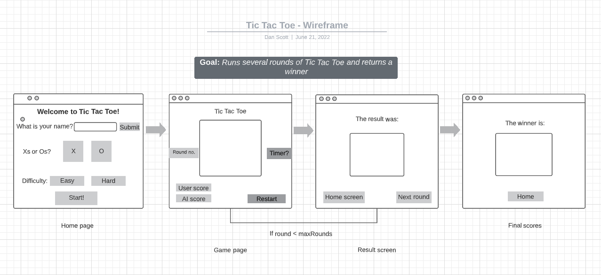

# Tic-Tac-Toe

A game of luck, strength and skill. The every person's Chess.

#### Built using
 - HTML5
 - CSS
 - Javascript

 ## The Game
 Tic-Tac-Toe is a very approachable, easy game that people of all ages can Enjoy. I wanted to keep my version simple and comfortable, that any could get into straight away.

 I did some initial planning and drew up a wireframe of what I imagine the game process being. 
 
 
 
 I ended up using only one screen, rather than 3 or 4 - but the wireframe was helpful during the initial coding and element shaping.

 I decided to make a Minimal Viable Product first, and then build functionality into the app later - rather than try and add scalability from the beginning.

 # Elements
 ## Files
 The app is across an `index.html` file, a `style.css` file and 3 `.js` files. Once to manage the script and initialisation and two to contain the 2 different game modes; 3x3 and 5x5.

## HTML
 I chose to keep the grid setup clean and simple, with the board element being generated as a `grid` within the .css styling. The only HTML elements that are visible on startup are the buttons and switches.

 The central portion of the `main` div is the board, which allows the user to focus on the game easily.

 ## CSS
 A simple, playful approach was taken with the styling. Too many different elements or options on the screen would detract from usability. The hand-drawn grids, tokens and header are all `.png` files created by my wife. It adds a nice casual feel.

     
   

 

 The board and token elements are generated in JS and then appended into the board area on startup or when switching boards. The board is set as a grid within the other external elements, which are set as a `flexbox`. The remaining backgrounds and styling elements are free-to-use photos and clipart. The idea was to lean towards a  aesthetic- emulating a real desk and pad.

 A simple animation is on the switch, as well as the grid-swap effect when changing board sizes.

 Buttons are large and function, with a `hover` colour reverse to aid with usability.

## JavaScript
The main functionality of the game is in Javascript, which creates the game boards, as well as populating the cells and tokens within.

The main `script.js` file contains the global variables and `eventListeners` that are used across all of the functions.

Separate files contain the `3x3game` and `5x5game` options, which offer 2 different grid sizes selected by button from the board. If I were to re-write the code I would have contained the 2 board sizes within the same file and functions- allowing easier scalability and additional sizes quite easily. There is unfortunately a fair bit of redundancy across the 2 files - but I wanted to ensure the code worked on a limited time frame so built out and debugged a second option separately.

The various `functions {}` of the app allow the user to:
 - Add tokens
 - Change game options
 - Restart the game from scratch, or a new round
 - Check for win, loss and draw end conditions - and end the game appropriately.

I decided to add some sound effects to make the game a little more amusing to play, these were sourced from  or recorded by myself with my Macbook microphone. The simplicity of using sounds in Javascript made it hard to refuse.

# Future functionality
 Given more time I would have set a match limit (perhaps of 5 matches) to add a final goal to multiple rounds.

 Also the option to select a "night mode" with different styling would be amazing.

 Additional grid sizes would be fun as well, but from experimentation the round length increases and possibility of a win tends to decrease - the higher the grid size - detracting from a quick, fun game experience.

 A more robust AI would be great, something that acts based on best moves - rather than randomly.

 I had considered the possibility of having multiple hand-drawn Xs and Os - and using a random number generator to select them before deploying to the board - creating a more realistic look.
 
 The option to input the user (and AI) name would be good, as well as customisable or selectable tokens.

 # How to use
 Run the game from the `index.html` file - or play the game on [Github](https://drinkwithdan.github.io/Tic-Tac-Toe/)

